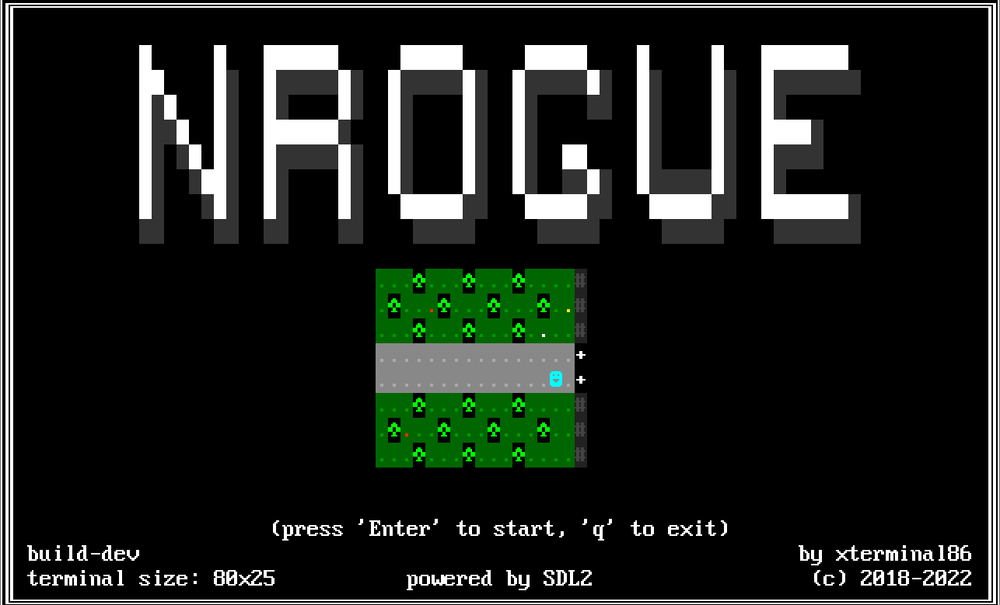
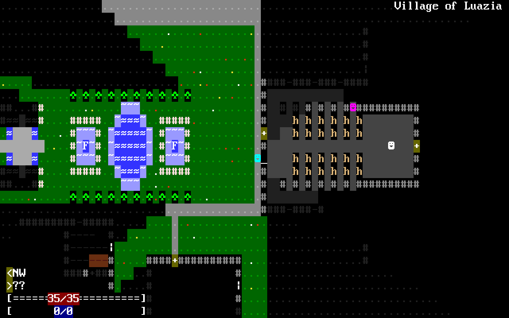
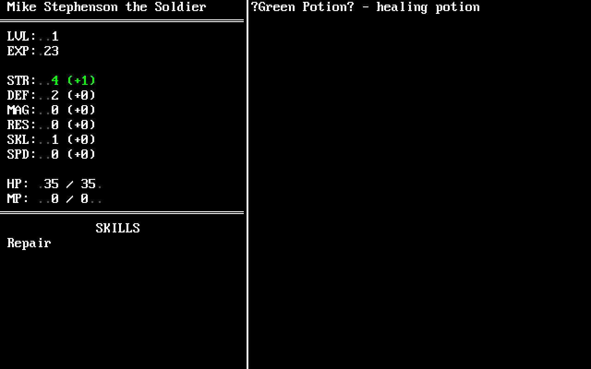
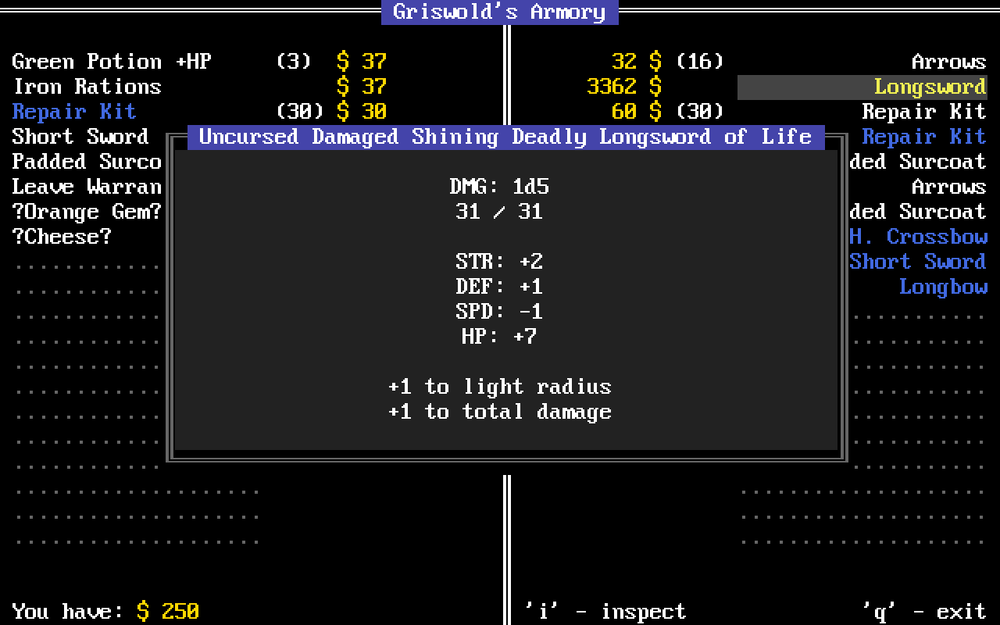

[](https://github.com/xterminal86/nrogue/actions/workflows/mingw.yml)
[](https://github.com/xterminal86/nrogue/actions/workflows/msvc.yml)
[](https://github.com/xterminal86/nrogue/actions/workflows/ncurses.yml)
[](https://github.com/xterminal86/nrogue/actions/workflows/linux.yml)


# NROGUE
*ncurses roguelike challenge*



I decided to challenge myself by making a game with minimal requirements possible.
Just like in old times, when all you had was just one binary file.
Since I'm working with Linux, I thought that making a game that uses just terminal libraries (e.g. ncurses)
seems like a perfect candidate. And what games are known to use terminal graphics? That's right, roguelikes.
So I decided to make a roguelike.
It probably should've been named **ncrogue** or something, but whatever...

You can build either version, SDL2 or ncurses, check comments in main.cpp.

When running an SDL2 executable, you can use custom font image and scale it by creating
file called "config.txt" and placing it alongside with the game's binary.
Transparent color key is magenta `(R:255, G:0, B:255)`.
Scale can be a floating point number (e.g. 1.5), but it's not recommended,
since non-integer scaling will result in distortions.
You can resize the window though.
The format is as follows (key-value pair separator `,` must always be present):

```
tileset               : "resources/std-8x16-ck.bmp",
tile_w                : 8,
tile_h                : 16,
scale                 : 2,
fast_combat           : 0,
fast_monster_movement : 0,
```

Two last lines are optional, they're off by default.
`fast_combat` disables visual attack display and `fast_monster_movement` doesn't force redraw after each visible monster's turn.
Both of these options reduce gameplay lag, although with `fast_monster_movement != 0` it may sometimes look as if
enemy just spawned before player if said monster had much larger SPD than player, which allowed it to perform several
turns that were not force redrawn.

<TABLE>
  <TR>
    <TD colspan="2" align="center"><B>SCREENSHOTS</B></TD>
  </TR>
  <TR>
    <TD></TD>
    <TD></TD>
  </TR>
  <TR>
    <TD></TD>
    <TD></TD>
  </TR>
</TABLE>
