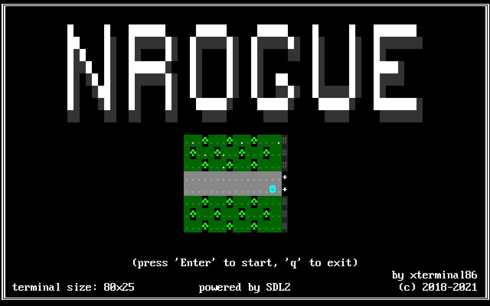

# NROGUE
*ncurses roguelike challenge*



I decided to challenge myself by making a game with minimal requirements possible.  
Just like in old times, when all you had was just one binary file.  
Since I'm working with Linux, I thought that making a game that uses just terminal libraries (e.g. ncurses)
seems like a perfect candidate. And what games are known to use terminal graphics? That's right, roguelikes.  
So I decided to make a roguelike.  
It probably should've been named **ncrogue** or something, but whatever...

You can build either version, SDL2 or ncurses, check comments in main.cpp.

When running an SDL2 executable, you can use custom font image and scale it by creating
file called "config.txt" and placing it alongside with the game's binary.
Transparent color key is magenta (R:255, G:0, B:255).
Scale can be a floating point number (e.g. 1.5), but it's not recommended,
since non-integer scaling will result in distortions.
You can resize the window though.
The format should be as follows (no empty lines):

```
FILE=resources/standard_8x16.bmp  
TILE_W=8  
TILE_H=16  
SCALE=2  
```
