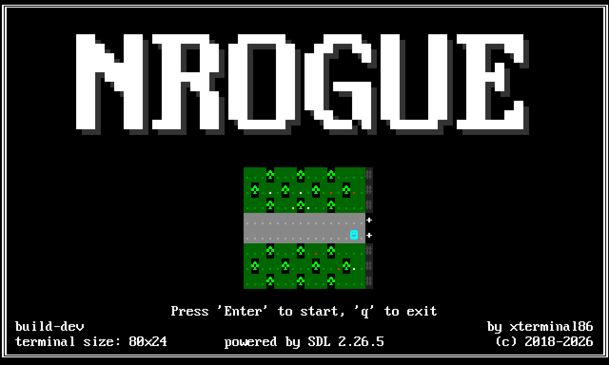
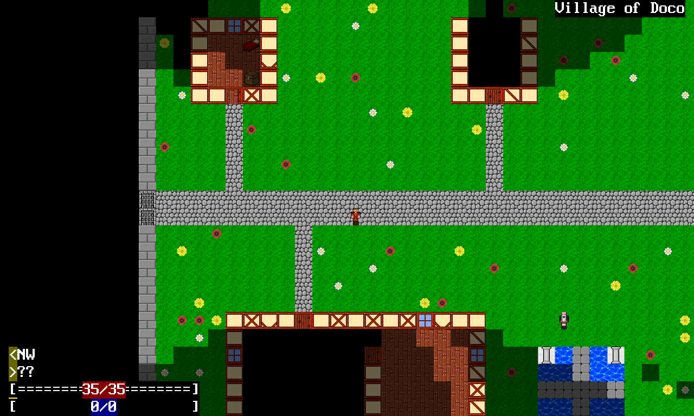
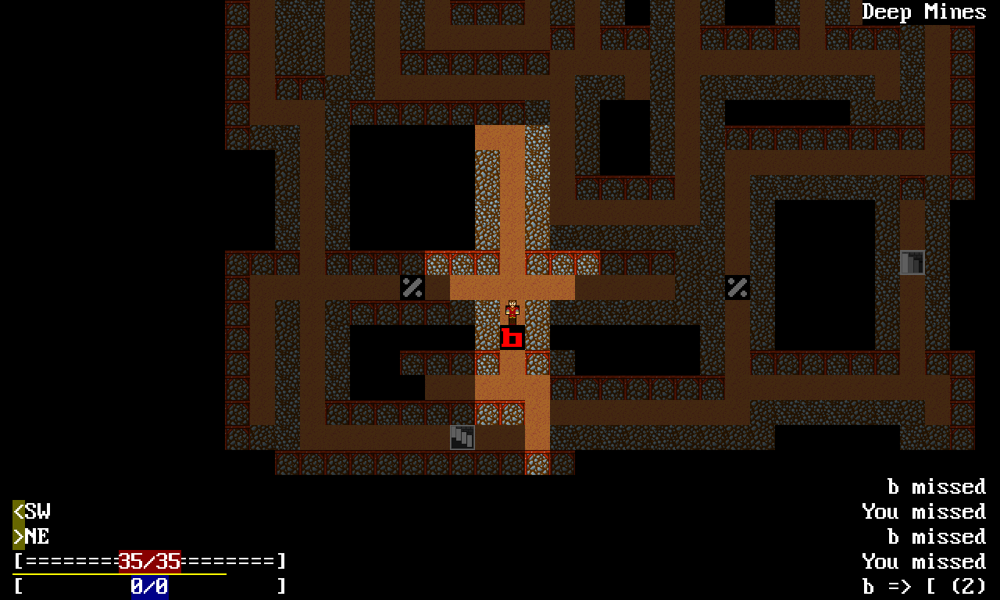
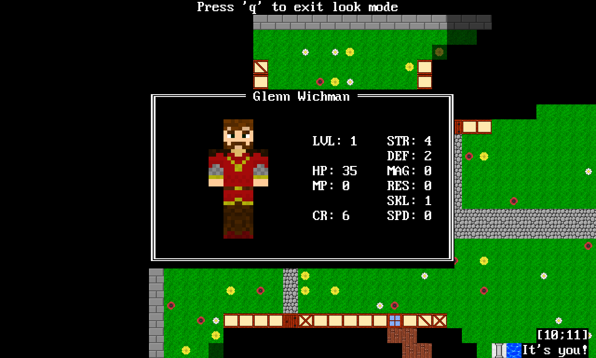
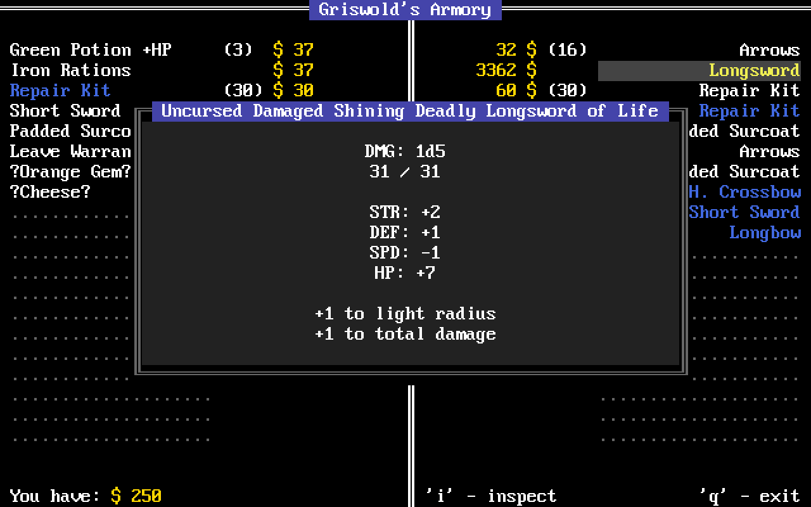

# NROGUE

*ncurses roguelike challenge*

I decided to challenge myself by making a game with minimal requirements possible.
Just like in old times, when all you had was just one binary file.
Since I'm working with Linux, I thought that making a game that uses just terminal libraries (e.g. ncurses)
seems like a perfect candidate. And what games are known to use terminal graphics? That's right, roguelikes.
So I decided to make a roguelike.
It probably should've been named **ncrogue** or something, but whatever...

You can build either version, SDL2 or ncurses, check comments in main.cpp.
Game has config file where certain parameters can be tweaked (check `config-template.txt`).

<TABLE>
  <TR>
    <TD colspan="2" align="center"><B>SCREENSHOTS</B></TD>
  </TR>
  <TR>
    <TD></TD>
    <TD></TD>
  </TR>
  <TR>
    <TD></TD>
    <TD></TD>
  </TR>
</TABLE>
